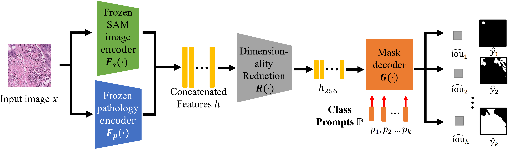

# SAM-Path: A Segment Anything Model for Semantic Segmentation in Digital Pathology
Pytorch implementation for the SAM-PAth framework described in the paper [SAM-Path: A Segment Anything Model for Semantic Segmentation in Digital Pathology](https://link.springer.com/chapter/10.1007/978-3-031-47401-9_16), [arxiv](https://arxiv.org/abs/2307.09570) and (_MedAGI 2023, accepted for oral presentation_).  
<div>
  
</div>

## Installation
Install [Anaconda/miniconda](https://www.anaconda.com/products/distribution).  
Install the dependencies of [SAM](https://github.com/facebookresearch/segment-anything). Please do not install the original SAM itself as we made some modifications.

Then Install required packages:
```
  $ pip install monai torchmetrics==0.11.4 pytorch_lightning==2.0.2 albumentations box wandb
```
## Data organization
Our dataset is organized as csv indicated datasets. All the images and masks should be stored in a directory and the path of this directory (```dataset_root```) should be set in the config file.
The root directory should contain two sub-directories ```img``` and ```mask```. All the input images and masks should be directly put into these two sub-directories respectively.
Our preprocessed dataset can be downloaded from: [https://drive.google.com/drive/folders/1BUPZz3nB52J5zRs1ZcEvNK03zw18BeLN?usp=sharing](https://drive.google.com/drive/folders/1BUPZz3nB52J5zRs1ZcEvNK03zw18BeLN?usp=sharing)

The file names and train/validation/test separation are listed in the csv file. This csv file should contain 2 columns: ```img_id``` and ```fold```. ```img_id``` is the filename of input image without the file extension. ```fold``` is the integer label of an input image. -1 means it is a test sample. We use the ```fold=0``` as the validation dataset and ```fold=1,2,3,4``` as the training dataset. The csv files we used are provided in the ```dataset_cfg``` folder. 


## Training
We used ```train.py``` to train and evaluate our framework. 
```
usage: main.py [--config CONFIG_PATH] [--devices GPU_ID]
               [--project PROJECT_NAME] [----name RUN_NAME]
```
For example:
```
python main.py --config configs.BCSS --devices 0 --project sampath --name bcss_run0
python main.py --config configs.CRAG --devices 1 --project sampath --name crag_run0
```
Config files are located in the ```configs``` folder. Not the extension ```.py``` should not be included and the sub-folders should be linked by ```.```
Pretrained SAM and HIPT models can be downloaded from their ogriginal repository: [SAM](https://github.com/facebookresearch/segment-anything#model-checkpoints) and [HIPT](https://github.com/mahmoodlab/HIPT#pre-reqs--installation).

## Predicting
We used ```predict.py``` to predict the mask of a dataset. 
```
usage: predict.py [--config CONFIG_PATH] [--devices GPU_ID]
                  [--pretrained path_to_pretrained_weights] 
                  [--input_dir path_to_image_directory] 
                  [--data_ext image_extension] 
                  [--output_dir path_to_output_directory]
```
For example:
```
python predict.py --config configs.BCSS --input_dir path_to_image_directory --data_ext .png --output_dir path_to_output_directory --pretrained /.../model.ckpt  --devices 2
```
Note that we always use label 0 as the unlabeled region. If the dataset does not contain any unlabeled region, all the predicted masks need be subtracted by 1.


## Contact
If you have any questions or concerns, feel free to report issues or directly contact us (Jingwei Zhang <jingwezhang@cs.stonybrook.edu>). 

## Citation
If you use the code or results in your research, please use the following BibTeX entry.  
```
@article{zhang2023sam,
  title={SAM-Path: A Segment Anything Model for Semantic Segmentation in Digital Pathology},
  author={Zhang, Jingwei and Ma, Ke and Kapse, Saarthak and Saltz, Joel and Vakalopoulou, Maria and Prasanna, Prateek and Samaras, Dimitris},
  journal={arXiv preprint arXiv:2307.09570},
  year={2023}
}
```
